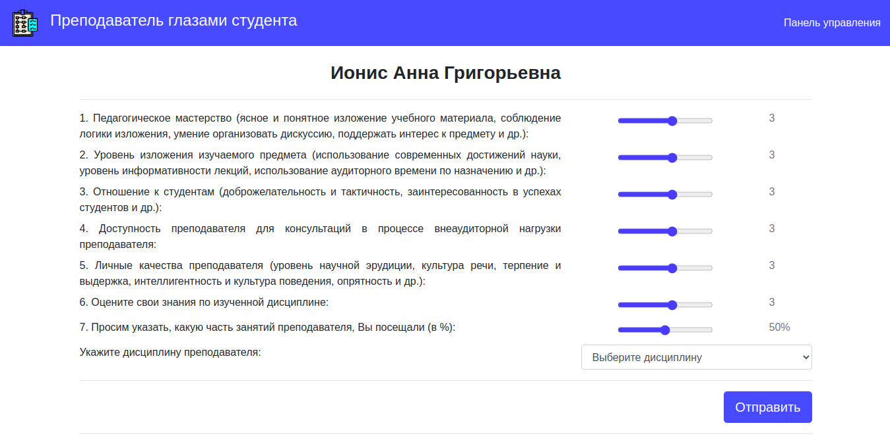

### Ugatu-anketa

(https://ugatu-anketa.herokuapp.com)  

Веб-сайт для проведения анонимного анкетирования студентов на тему «Преподаватель глазами студента».

**[Описание интерфейса](interface.md)**

**REST API (json):**
  - Возвращение списка (*index*) и сущности (*show*) для:
    - Факультет (*app/controllers/api/v1/faculties_controller.rb*);
    - Кафедра (*app/controllers/api/v1/departments_controller.rb*);
    - Преподаватель (*app/controllers/api/v1/lecturers_controller.rb*);
    - Группа (*app/controllers/api/v1/university_groups_controller.rb*);
  - Создание (*create*) для:
    - Анкета (*app/controllers/api/v1/questionnaires_controller.rb*);
  
**RSpec-тесты**:
- Модели:
  -  Кафедра: *app/spec/models/department_spec.rb*;
  -  Дисциплина: *app/spec/models/discipline_spec.rb*;
  -  Факультет: *app/spec/models/faculty_spec.rb*;
  -  Преподаватель: *app/spec/models/lecturer_spec.rb*;
  -  Анкета: *app/spec/models/questionnaire_spec.rb*;
  -  Группа: *app/spec/models/university_group_spec.rb*;
- Запросы (*app/spec/requests/\*.rb*);
- Интеграционный - создание факультета (*app/spec/features/faculties_spec.rb*).   
---
*gems:*
 - active_median: *расчет медианных значений для ActiveRecord;*
 - chartkick: *отрисовка круговых диаграмм;*
 - devise/pundit: *регистрация/аутентификация пользователя, права пользователя;*
 - fast_jsonapi: *для создания API.*
- - -
Ruby 2.7.1; Rails 6.0.3