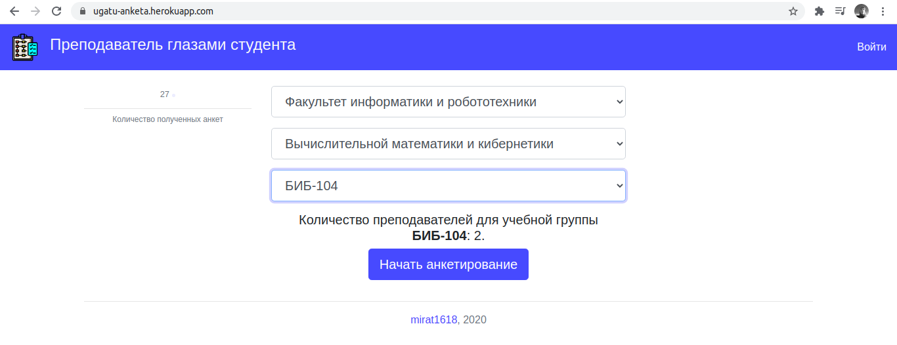
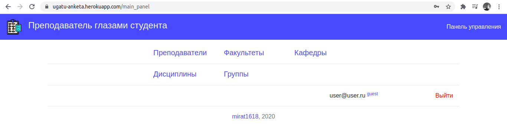
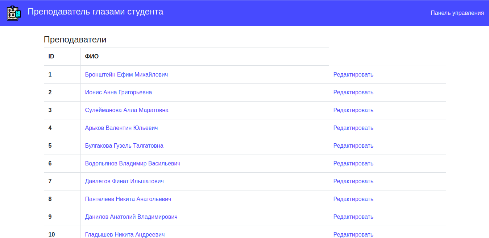
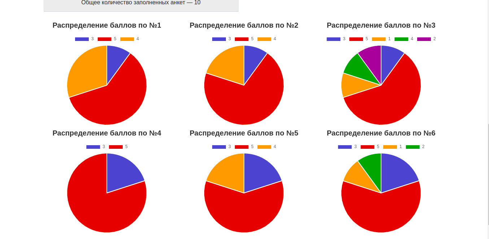
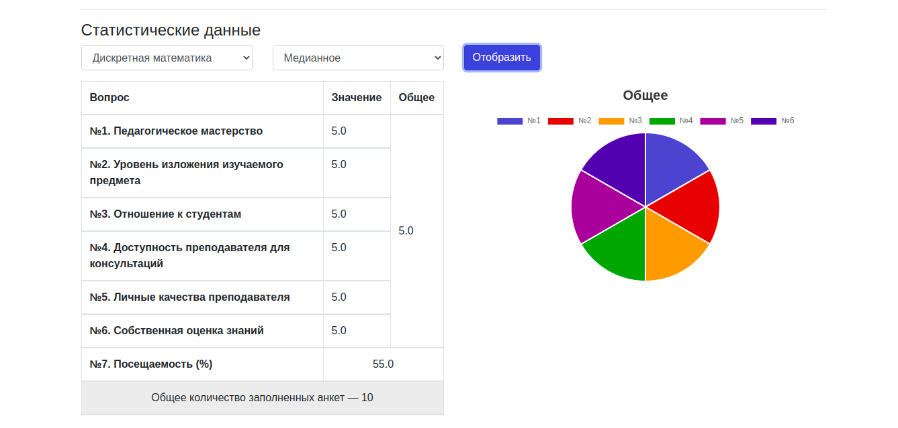

### Ugatu anketa

(https://ugatu-anketa.herokuapp.com)  

Веб-сайт для проведения анонимного анкетирования студентов на тему «Преподаватель глазами студента».

Главная страница:

Указание факультета и кафедры позволяет выбрать соответствующую учебную группу:

Содержание анкеты:

Панель управления пользователя:

Роли пользователей:
- **Гость** (guest). Имеет право просмотра:

- **Аналитик** (analyst). Имеет право просмотра, редактирования и создания:

- **Администратор** (admin). Имеет право просмотра, редактирования, создания, удаления:

Статистика отображается следующим образом:

Расчет выполняется:
- По каждой из дисциплин преподавателя, либо по всем дисциплинам;
- Среднее значение, либо медианное:

_ _ _
Ruby 2.7.1; Rails 6.0.3