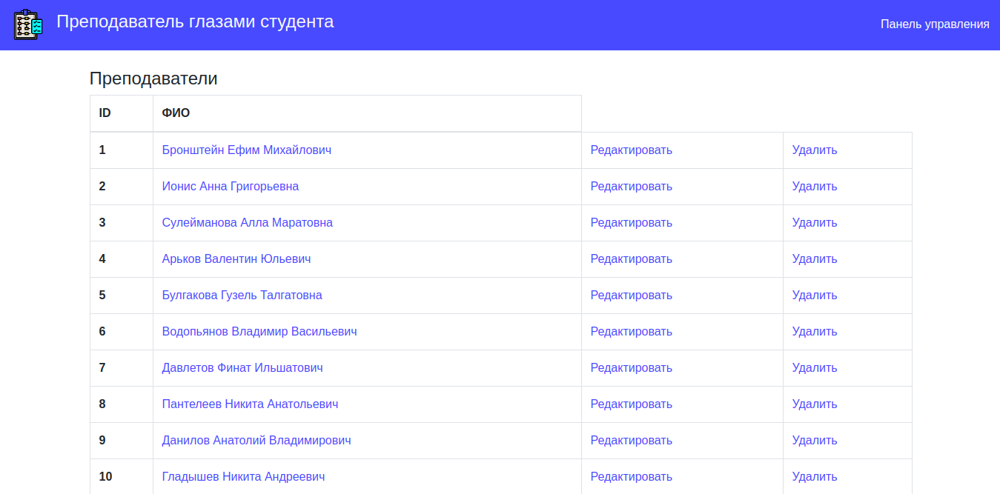

### Ugatu anketa

(https://ugatu-anketa.herokuapp.com)  

Веб-сайт для проведения анонимного анкетирования студентов на тему «Преподаватель глазами студента».

Главная страница:

Указание факультета и кафедры позволяет выбрать соответствующую учебную группу:

Содержание анкеты:

Панель управления пользователя:

Роли пользователей:
- Пользователь (user):
    - Имеет право просмотра:
    
- Аналитик (analyst);
    - Имеет право просмотра, редактирования и создания:
    
    
- Администратор (admin).
    - Имеет право просмотра, редактирования, создания, удаления:
    

Модели:
- Факультет (faculty);
- Кафедра (department);
- Университетская группа (university group);
- Преподаватель (lecturer);
- Дисциплина (discipline);
- Анкета (questionnaire);
- Пользователь (user).

_ _ _
Ruby 2.7.1; Rails 6.0.3