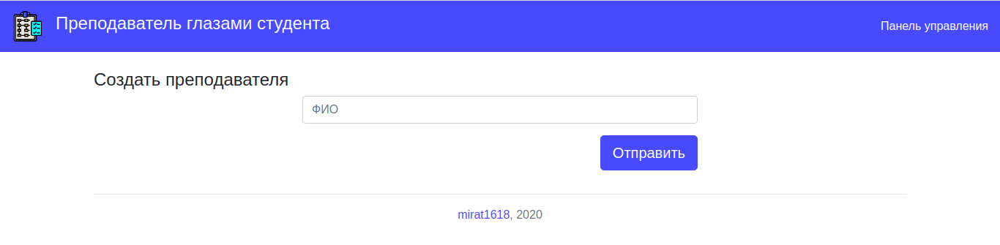

### Описание интерфейса

Главная страница:
> 

Указание факультета и кафедры позволяет сузить выбор учебных групп для удобства:
> 

Форма анкеты:
> 

Панель управления пользователя:
> 

Роли пользователей:
- **Гость** (guest). Имеет право просмотра:
> 
- **Аналитик** (analyst). Имеет право просмотра, редактирования и создания:
> 

> 
- **Администратор** (admin). Имеет право просмотра, редактирования, создания, удаления:
> 

Статистика отображается следующим образом:
> 

> 

Расчет выполняется:
- По каждой из дисциплин преподавателя, либо по всем его дисциплинам;
- Среднее значение, либо медианное:
> 

На странице преподавателя находятся формы редактирования его данных,
указания привязки к факультету/кафедре/учебным группам:
> 

> 

> 

На странице учебной группы имеется форма привязки преподавателей:
> 

На странице кафедры также представлена форма привязки преподавателей:
> 
_ _ _